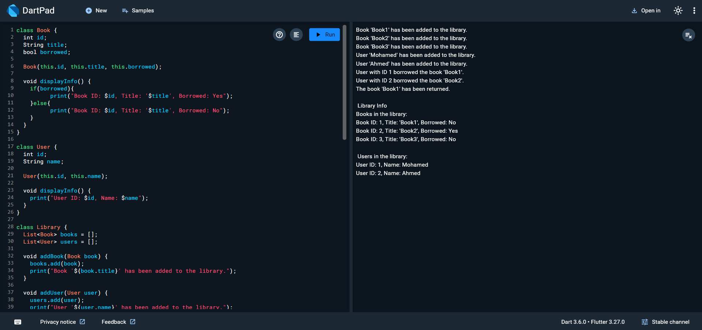

# LibrarySystem

## Description
This system to manage books and users in a library. It allows users to borrow and return books and keeping track of the library's info in an organized way.

## How to Run
1. Clone the repository or copy the `main.dart` file to your local system.
2. Navigate to the project directory in your terminal.
3. Run the program using the following command:
   ```bash
   dart run main.dart

   
## Example Output



## Features

- **Add books to the library**
- **Add users to the library**
- **Borrow books**
- **Return books**
- **Display info of the library**

